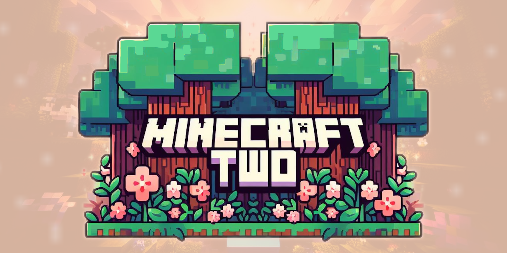

  

---

A modpack for Minecraft that extends beyond what would be considered Vanilla+ but still very much in the spirit of the vanilla game.

---
 

## Client Setup

 1. Download the latest release (Minecraft.Two.1.19.2.mrpack) from:  
https://github.com/itsmetrevor/minecrafttwo-modpack/releases

 2. Download a Minecraft Launcher. I recommend ATLauncher:  
https://atlauncher.com/downloads

 3. Install the Launcher and sign in with your Minecraft account.

    **_The following steps apply to ATLauncher_**  

 4. Select Instances on the right and then click Import in the upper left.

 5. Click the Import button in the upper left

 6. Click Browse and select the Minecraft.Two.1.19.2.mrpack you downloaded earlier.

 7. Click Import, at the bottom of the Import Instance window, give the pack a name of your choosing, make sure Version is set to 1.19.2, and click Install.

 

## Server Setup
TODO

 

## Resources

https://docker-minecraft-server.readthedocs.io/en/latest/